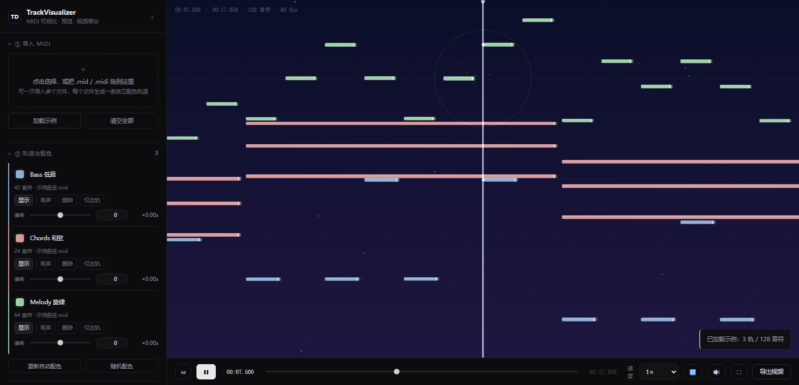
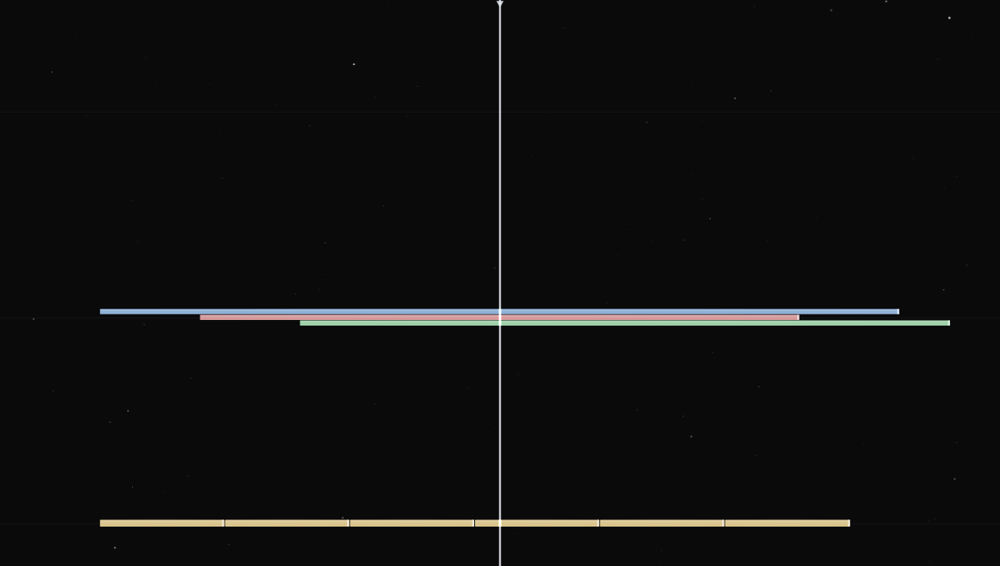

# TrackVisualizer · MIDI 可视化播放器

零依赖的纯前端 MIDI 可视化工具。导入 MIDI 后，音符从右向左飞过屏幕中央的竖线，
撞线瞬间触发粒子 / 冲击波 / 闪光特效，支持多文件独立配色，并可把结果录制导出为视频。

**直接用浏览器打开 `index.html` 即可运行**——不需要 npm install、不需要构建、不联网。



---

## 快速开始

1. 双击 `index.html`（推荐 Chrome / Edge 最新版）
2. 点击 **加载示例** 先看效果，或把 `.mid` / `.midi` 拖进页面
3. 空格播放，`F` 进入沉浸模式，`E` 导出视频

## 功能一览

| 需求 | 实现 |
| --- | --- |
| 黑色背景（可定制） | 深蓝→深紫纵向渐变（可关）＋ 拖尾残影 ＋ **常驻星空**（浅紫粒子，数量/大小/速度/闪烁均可调），中心辉光与暗角可按需开启 |
| 屏幕中间 100% 高的竖线 | 位置 15%~85% 可调，颜色 / 粗细 / 闪光可调 |
| 导入 MIDI 生成 note | 自研 SMF 解析器，支持 Format 0/1/2、变速、变拍号、running status |
| 开启预览后从右往左飞行 | 时间轴驱动，`预览时长` 决定竖线右侧可见秒数与小节网格 |
| 高度与音高对应 | 自动或手动指定音高范围，可选八度分隔线与音名标签 |
| 上传复数 MIDI 并各自配色 | 每个文件生成独立轨道：取色器改色 / 显示隐藏 / 静音 / 仅此轨 / **按小节偏移** |
| note 碰撞竖线触发特效 | 粒子爆散 + 冲击波圆环 + 竖线闪光 + 命中增亮 + 屏幕震动（可逐项调节） |
| 浮动感 | 上下漂浮 + 呼吸缩放 + 弯曲拖影 + 命中回弹，强度可调可关 |
| 重叠音符正确显示 | 同音高的重叠音符自动分到子声道互不遮挡，相邻音符留接缝 |
| 导入音频 | 支持 mp3 / wav / ogg / m4a / flac 等，可导入多个、各自调偏移与音量、静音、重命名 |
| 网页本体支持预览 | 播放 / 暂停 / 进度拖拽 / 倍速 0.25×~4× / 循环 / 沉浸全屏 / 监听静音 |
| 视频导出 | 离屏按目标分辨率渲染 + MediaRecorder 录制，支持 MP4(H.264) / WebM(VP9)，音源可选导入音频或合成器 |

## 界面风格

默认走**极简 / 低饱和**路线：发丝级分隔线、无渐变无辉光的界面，颜色只用于表达状态。
画布侧是深蓝→深紫的纵向渐变夜空 + 浅紫星点，配中性灰竖线与低饱和轨道配色；
默认关闭节拍网格、命中闪光、中心辉光与暗角，音符近乎直角、高度比例 0.4（偏扁），
越过竖线后不淡出、继续匀速飞出画面，预览时长 2 秒。

星空是常驻背景层，多层视差缓慢左移，**暂停时依然漂浮**；音符撞线时竖线附近的星星会微微亮一下。
「④ 背景与网格」里可调星星的颜色 / 数量 / **粒子大小** / 漂移速度 / 闪烁幅度，以及背景上下两端的颜色。

想换回高饱和的「霓虹」观感，改两处即可：

- **界面**：`css/style.css` 顶部的 `:root` 变量（`--accent` / `--hair` / `--bg` 等）
- **画布**：`js/app.js` 顶部的 `PALETTE` 数组（新导入轨道的默认配色）；
  已在工程里的轨道直接用「轨道与配色」里的取色器单独改，
  竖线、背景、网格颜色都在「④ 背景与网格」面板里。

## 快捷键

| 按键 | 作用 |
| --- | --- |
| `空格` | 播放 / 暂停 |
| `R` | 回到开头 |
| `←` `→` | 快退 / 快进 2 秒（按住 `Shift` 为 10 秒） |
| `F` | 沉浸模式（隐藏面板并全屏） |
| `E` | 导出视频 |
| `Tab` | 收起 / 展开侧边面板 |
| `Esc` | 取消导出 / 退出沉浸模式 |

## 浮动感

音符不是硬邦邦地平移，而是「浮」过来的。`③ 视图与音符 → 浮动感`：

| 项目 | 说明 |
| --- | --- |
| 浮动强度 | 上下漂浮幅度（默认 4，0 即完全关闭）。两个不同频率的正弦叠加，每个音符按音高与轨道错开相位，不会整齐划一 |
| 拖影层数 | 身后留几层渐隐残影（默认 2）。残影取的是「稍早时刻」的位移，所以漂浮时会画出弯曲的轨迹 |
| 呼吸缩放 | 音符高度轻微起伏，像在水里 |
| 命中回弹 | 撞线瞬间被弹开一下再落回，方向随机 |

命中特效（粒子 / 冲击波）会跟随音符**当前实际所在的位置**喷出，而不是音高槽中心，
所以浮动与回弹都不会让特效脱节。

## 开场留白与导出预热

导出开头容易掉帧：光晕贴图、背景层、星空数组都是首次用到才创建，编码器也需要启动时间。
这里做了两层处理：

1. **预热**（自动，无需设置）：正式开始录制前先离屏渲染 10 帧，把各类缓存与 JIT 跑热；
   录制启动后再按住时间轴约 0.35 秒让编码器进入状态——这段静止画面落在留白区里，不影响内容。
2. **开场留白**（`③ 视图与音符 → 时间轴`，默认 2 秒）：曲子整体后移 N 秒，前面留一段空镜。
   即使仍有零星掉帧，也落在没有内容的留白区，不会毁掉开头。导出时会一并录进去。

留白设 0 时长度就是纯内容长度；设 2 秒则整条时间轴（含预览与导出）都会多出这 2 秒。

导出过程中时间轴改为**以音频时钟为准**，画面与声音不会漂移。

## 轨道偏移（按小节）

每条 MIDI 轨道都能整体提前或延后，单位是**小节**而不是毫秒——对齐多轨或对齐音频时，
按小节挪动才是音乐上正确的操作。范围 ±64 小节，数字框也接受小数（如 `0.5` 表示半小节）。

换算优先使用该文件**真实的小节线时刻**，所以变速曲目也准确：120BPM 4/4 的曲子里
`+2` 就是 +4.00 秒，而带变速的曲子里 `+2` 会自动取第 2 条小节线的实际时间。
超出已知小节数时按平均小节长外推。行内会实时显示换算后的秒数（如 `+4.00s`）。

## 重叠音符的处理

同一音高上出现多个音符（多轨同音、踏板延音、声部交叉）时，如果直接叠着画，
后画的会把先画的完全盖住，看起来「少了一个音」。渲染器对此做了三件事：

1. **子声道分层**：把同音高的重叠音符聚成连通组，组内做区间着色分配到不同
   「子声道」，每个音符占据音高槽的一小条，垂直方向互不接触——三个音叠在一起也能同时看清。
   只有真正发生重叠时才分层，单独出现的音符高度分毫不变。
   跨轨道的同音高音符同样参与分层，因此不同颜色都能露出来。
2. **相邻接缝**：首尾相接（间隔 < 12 ms）的同音高音符会在右端留出一条约 1.5px 的接缝，
   否则连音会被看成一根长条、数不出音符个数。
3. **命中特效跟随**：粒子与冲击波从音符实际所在的子声道中心喷出，而不是音高槽中心。



上图：同一音高上的三个音符被分到三条子声道（蓝/粉/绿都可见）；
下方黄色是同轨连续八分音符，靠接缝区分出 6 个音。

## 音频

两条音源共用同一个 `AudioContext` 时间基准，因此**彼此之间是采样级对齐的**：

- **内置合成器**：纯振荡器合成，无需素材，适合快速试听（`⑥ 内置合成器`）
- **导入音频**：直接拖入 mp3 / wav / ogg / m4a / flac（`⑦ 导入音频`），可多个同时混音

**偏移**是「音频第 0 秒对应的曲目时间」：填 `+120` 表示音频整体后移 120 ms，
填 `-120` 表示音频提前 120 ms——用它把音频和 MIDI 对齐。
滑杆用于粗调，右侧数字框可直接键入毫秒值精调。时间轴长度会自动取
「MIDI 末尾」与「所有音频末尾」的较大者，保证长于 MIDI 的音频不会被截断。

倍速播放时导入音频使用 `playbackRate`，因此**会变调**（类似磁带变速）；
内置合成器则保持音高不变。

### 导出时的音源

`⑧ 视频导出` 的「音频来源」有四档：

| 选项 | 行为 |
| --- | --- |
| 自动 | 有导入音频就用导入音频（静音合成器），否则用合成器 |
| 仅导入音频 | **静音合成器**，只录导入的音频 |
| 仅内置合成器 | 忽略导入音频，只录合成器 |
| 两者混合 | 一起录进去 |

传输条上的 🔊 按钮是**预览监听开关**：静音后本地听不到声音，但**不影响导出结果**
（监听与录制是两条独立链路）。

## 视频导出说明

- 导出是**实时录制**：导出 3 分钟的曲子约需 3 分钟，进度条会显示百分比与剩余时间。
- 录制期间请保持标签页在前台，切到后台浏览器会限制动画帧率，导致视频掉帧。
- 编码器按浏览器能力自动选择，优先 **MP4 (H.264)**；若浏览器不支持则回退 **WebM (VP9)**，
  页面会明确提示实际使用的格式。WebM 可用剪辑软件（或 `ffmpeg -i in.webm -c copy out.mp4`）转码。
- 导出分辨率 / 帧率 / 码率独立于预览窗口，渲染器全部按 1080p 高度为基准等比缩放，
  因此预览与 4K 成片的构图完全一致。
- 「混入音频轨道」控制是否给视频加音轨，具体用哪条音源见上方「音频 → 导出时的音源」。

## 性能

渲染器针对密集谱面做了批处理优化（按 轨道 × 透明度档位 合批填充、粒子按颜色合批、
背景与暗角层缓存、光晕高密度时抽样）。软件渲染（`--disable-gpu`）下实测：

| 场景 | 帧率 |
| --- | --- |
| 示例曲目（3 轨 / 128 音符） | 60 fps |
| 密集谱面（8 轨 / 9600 音符 / 48 音符每秒） | 58.7 fps |
| 极端压力（24 轨 / 21600 音符 / 400 音符每秒） | 30.7 fps |

开启 GPU 加速的真实浏览器会明显更快。若仍然卡顿，可降低「粒子数量」「音符光晕」，
或关闭「节拍网格 / 暗角 / 中心辉光」。

## 目录结构

```
index.html            页面结构与全部控件（控件用 data-setting 声明默认值）
css/style.css         深色 UI 样式
js/util.js            颜色缓存、圆角矩形、时间格式化等工具
js/midi-parser.js     标准 MIDI 文件解析器 + 变速表（tick → 秒）
js/midi-demo.js       内置示例曲目（内存中直接构造 SMF 字节流）
js/effects.js         命中特效：粒子 / 冲击波 / 闪光
js/audio-engine.js    WebAudio 引擎：内置合成器 + 导入音频，共用一个时间基准
js/renderer.js        画布渲染器 + 命中判定 + 星空 + 布局计算
js/exporter.js        视频导出（离屏渲染 + MediaRecorder + 音轨混入）
js/app.js             状态管理、交互绑定、播放循环、导出调度
test/                 自测脚本（见下）
```

## 自测

```bash
npm test              # 解析器 + 渲染器 + 音频引擎单测（纯 Node，无需浏览器）
npm run test:browser  # 用无头 Edge/Chrome 打开页面并读取真实 canvas 像素
npm run test:export   # 端到端导出 2 秒 MP4 并校验容器魔数
npm run test:audio-e2e# 现场生成 WAV → 导入 → 播放 → 导出，校验音轨真的进了容器
npm run test:perf     # 帧率剖析（可用 TD_TRACKS / TD_PER / TD_GAP 调整密度）
```

浏览器相关脚本通过 CDP 驱动（零依赖，Node 22+ 自带 WebSocket）。
如需指定浏览器：`TD_BROWSER="C:\path\to\chrome.exe" npm run test:browser`。

## 已知限制

- MIDI 解析忽略 SysEx / 控制器细节，只取音符、速度、拍号与轨道名（可视化不需要更多）。
- 多文件导入时节拍网格取首个文件的拍号，变速以各自的 Tempo Map 换算时间。
- 导出为实时录制，长曲目耗时与曲目等长；不支持“抽帧离线加速”。
- 倍速播放时导入音频会变调（`playbackRate` 的固有行为）。
- 导入音频只在本地解码播放，不做波形显示与剪辑。
- 合成器音色为振荡器合成，非采样音源；追求音质请导入音频。

## 许可

MIT
